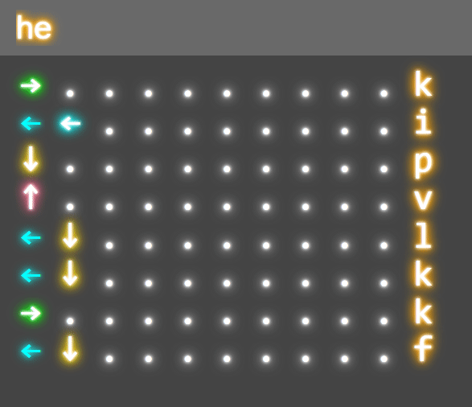

# About

This project was originally created by fonfonbee posted on codepen
([link](https://codepen.io/fonfonbee/pen/rNwazmK)).
I found the project on a reddit post they made
([link](https://www.reddit.com/r/badUIbattles/comments/pcewln/arrow_keys_game_input/)).

When I saw fonfonbee's project, I decided to try add a auto function to it.
Basically, make it where you just have to enter text and it'll automatically
enter all the arrows needed to type those characters.

Also wanted to learn more JavaScript, so doing this as a first project was a
interesting idea.

# auto-arrow-keys-input
The original project was purposely made to be a bad UI. Its a keyboard, only
you need to type out characters by inputting the correct arrow sequence, by using
your arrow keys on the keyboard.

## Auto
This project adds a auto function to it. There are two ways to make it easier to type.

1. Typing out a string
    * You can do this by pressing `control` and a text prompt will come up. Enter some text and it will do the rest.
    
2. Letter by letter.
    * You can also use your keyboard to type. If you press any letter on the keyboard, it will automatically enter it. `warning: push a letter and wait for it to complete. If you type too fast it may glitch out`
    